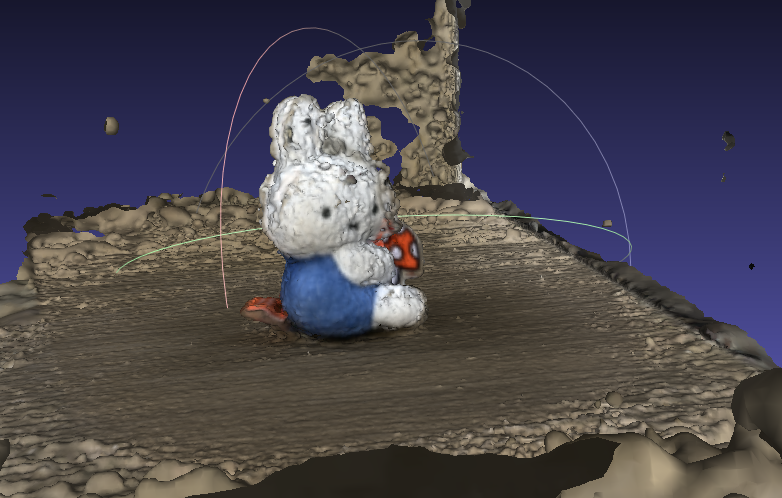

# RV_Final_HW
로봇비전 파이널 프로젝트


# colmap 설치

빌드시 그래픽 드라이버와 cuda toolkit이 설치되어 있어야 한다.
```
sudo apt update
sudo apt install -y \
    git cmake ninja-build build-essential \
    libboost-program-options-dev libboost-graph-dev libboost-system-dev \
    libeigen3-dev libfreeimage-dev libmetis-dev libgoogle-glog-dev \
    libgtest-dev libgmock-dev libsqlite3-dev libglew-dev qtbase5-dev \
    libqt5opengl5-dev libcgal-dev libceres-dev libcurl4-openssl-dev

sudo apt -y install libopenblas-dev
sudo apt-get install libopenimageio-dev
sudo apt-get install openimageio-tools

git clone https://github.com/colmap/colmap.git
cd colmap
mkdir build && cd build
cmake .. -GNinja -DBLA_VENDOR=OpenBLAS -DCMAKE_CUDA_ARCHITECTURES=89
ninja
sudo ninja install

sudo apt install -y libgl1-mesa-glx libglib2.0-0

```
Colmap gui 실행
```
colmap gui
```
# 비디오 이미지로 변환
```
sudo apt-get update
sudo apt-get install ffmpeg
chmod +x convert.sh
./convert.sh
```

# 3D reconstruction
```
colmap gui
```
gui에서 reconstruction->에서 Automatic Reconstruction 선택후 작업 환경과 이미지 폴더 선택 
옵션으로는 Shared intrinsics, Sparse model / Dense model 등 선택 후 RUN


# 결과
<div align="center">
  <div style="margin-bottom: 10px;">
    
    <p style="text-align: center;">메쉬 결과</p>
  </div>
</div>